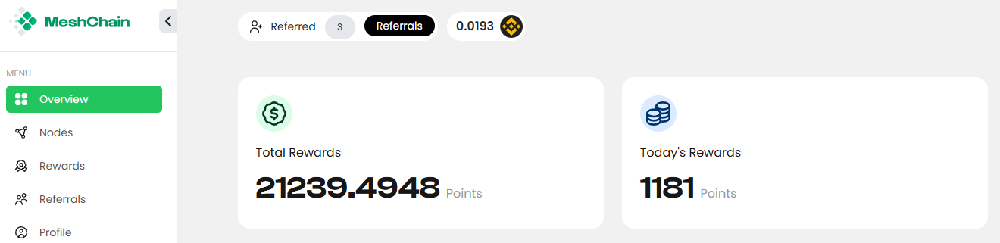
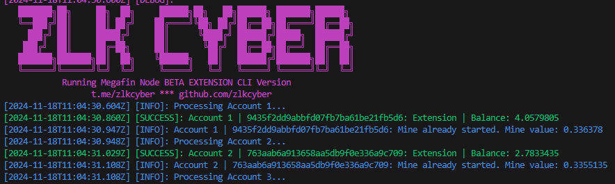
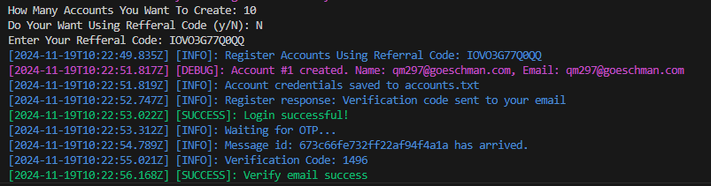

# MESHCHAIN NETWOTK

MeshChain is a decentralized network designed to provide affordable, scalable compute power for AI workloads. We address the high costs and limited access to AI resources, making it easier for everyone to contribute and benefit from the power of AI.

- [https://app.meshchain.ai/](https://app.meshchain.ai?ref=DJNMDUID1PL5)



# MeshChain Automation Script

## Update

- Solve captcha using anti-captcha [https://anti-captcha.com/](https://anti-captcha.com/)

This repository contains scripts for automating tasks such as user registration, email verification, claiming rewards, and starting mining on MeshChain.



## Features

- Support Multy accounts.
- Register new accounts.
- Verify email using OTP.
- Claim faucet BNB.
- Initialize and link unique nodes.

## Requirements

- Node.js 16+
- Dependencies installed via `npm install`
- new mail for each account (for email verification and claim faucet bnb)
- 1 account only can link with 1 nodeId so if you want farm it create multiple accounts.

## Files

- this file while auto generate if you register using script
- if you already have account you can create file manually
- `token.txt`: Stores tokens in the format `access_token|refresh_token` each line 1 account.
- got to [https://app.meshchain.ai/](https://app.meshchain.ai?ref=DJNMDUID1PL5) and inspect to get  `access_token|refresh_token`
- 

- `unique_id.txt`: Stores unique IDs for linked nodes each line 1 account.
- inspect mesh extension to get id
- 


## Usage

1. Clone the repository:
   ```bash
   git clone https://github.com/Zlkcyber/mesh-bot.git
   cd mesh-bot
   ```
2. install dependencies:
   ```bash
   npm install
   ```
3. Register account:
   ```bash
   npm run register
   ```
4. Run the bot:
   ```bash
   npm run start
   ```

## Additional Features:

- **Auto Register And Verify Using Temp Mail**

  ```bash
  npm run autoreg
  ```

  
